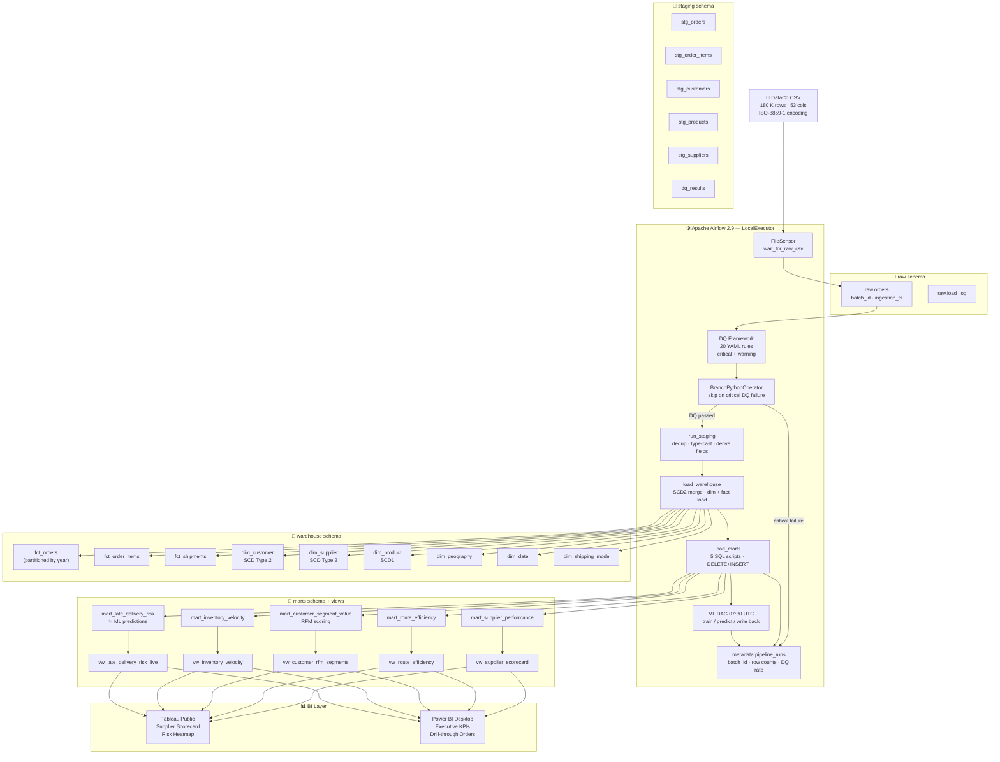

# Supply Chain Late-Delivery Intelligence Platform (LDIP)

End-to-end data engineering portfolio project: ingests 180 K supply chain order events daily, models them in a MySQL star schema, orchestrates with Airflow, scores late-delivery risk with a Random Forest classifier, and surfaces the results to Tableau Public and Power BI Desktop.

> **Portfolio framing.** Designed for a senior data engineer / analytics engineer role. Every design decision reflects production discipline: SCD Type 2 on two dimensions, YAML-driven DQ framework, partitioned fact tables, idempotent MERGE patterns, ML predictions written back to the mart layer, and CI on every push.

---

## Architecture



---

## Data Model — Star Schema

```
               dim_date          dim_shipping_mode
                  │                     │
dim_geography ────┤                     │
                  │                     │
dim_customer ─────┼──── fct_orders ─────┤
(SCD Type 2)      │                     │
                  │                     │
dim_supplier ─────┤    fct_order_items──┘
(SCD Type 2)      │
                  └─── fct_shipments
dim_product ──────────── fct_order_items
(SCD Type 1)
```

**Fact tables**

| Table | Grain | Partitioned |
|---|---|---|
| `fct_orders` | One row per order | Yes — by `order_date_key` year |
| `fct_order_items` | One row per order line | Yes — by `order_date_key` year |
| `fct_shipments` | One row per shipment event | Yes — by `order_date_key` year |

**Dimension tables**

| Table | SCD strategy | Tracked columns |
|---|---|---|
| `dim_customer` | Type 2 | segment, city, state, country |
| `dim_supplier` | Type 2 | name, performance_tier |
| `dim_product` | Type 1 (overwrite) | price, category, department |
| `dim_geography` | Static + append | country → state → city hierarchy |
| `dim_date` | Pre-generated | date_key, week, month, quarter, fiscal attributes |
| `dim_shipping_mode` | Static seed | 4 modes |

---

## Mart Layer

| Mart | Grain | Audience | Key metric |
|---|---|---|---|
| `mart_supplier_performance` | supplier × month | Procurement | composite_score (on-time×0.50 + margin×0.30 + volume×0.20) |
| `mart_route_efficiency` | shipping_mode × region × month | Operations | efficiency_score, late_delivery_rate |
| `mart_customer_segment_value` | customer × month | Marketing / CX | RFM score (NTILE quintiles) |
| `mart_inventory_velocity` | product × month | Supply Planning | velocity_tier (fast / medium / slow / dead) |
| `mart_late_delivery_risk` | order (live) | Operations / SLA | predicted_risk_score (ML) |

Each mart has a corresponding analytical view (`vw_*`) that adds tier labels, ranking columns, and hex color codes for direct BI consumption.

---

## ML Pipeline — Late Delivery Classifier

**Model:** `RandomForestClassifier` (scikit-learn)
**Features:**
- Categorical (one-hot): `shipping_mode`, `order_region`, `customer_segment`, `product_category`
- Numeric (standard-scaled): `days_for_shipment_scheduled`, `order_item_quantity`

**Target:** `actual_is_late` (binary)
**Class weight:** `balanced` — handles the ~35% late-delivery base rate
**Output:** `predicted_risk_score` (float 0→1), `predicted_is_late` (binary at 0.50 threshold)

The ML DAG (`dag_ml_late_delivery`) runs at 07:30 UTC — 90 minutes after the main pipeline — to ensure the mart is populated before scoring. It retrains automatically when the mart has grown by > 500 rows since the last training.

---

## Airflow DAGs

### `dag_supply_chain_daily` — 06:00 UTC

```
wait_for_raw_csv (FileSensor)
    └─ load_raw
        └─ run_dq_checks
            └─ branch_on_dq
                ├─ [critical DQ failure] → skip_on_critical_dq_failure → log_pipeline_run
                └─ [DQ passed] → run_staging → load_warehouse → load_marts → log_pipeline_run
```

| Feature | Detail |
|---|---|
| Retries | 3 attempts · exponential backoff 30 s → 60 s → 120 s |
| SLA | Alert if DAG exceeds 3 hours |
| XComs | `batch_id`, `has_critical_failures`, `dq_pass_rate` |
| Idempotency | Re-run produces identical warehouse state |

### `dag_supply_chain_backfill` — manual trigger

```
generate_month_list → backfill_warehouse → backfill_marts [per month, parallel] → log_backfill_summary
```

```bash
airflow dags trigger dag_supply_chain_backfill \
    --conf '{"start_date": "2015-01-01", "end_date": "2018-01-31"}'
```

### `dag_ml_late_delivery` — 07:30 UTC

```
check_mart_ready → train_or_load_model → score_all_orders → log_ml_run
```

---

## Build Phases

| Phase | Status | Description |
|---|---|---|
| 1 — Data Foundation | ✅ Complete | Docker Compose stack, all DDL (raw → staging → warehouse → marts → metadata), raw CSV loader |
| 2 — Python Transforms | ✅ Complete | Dedup, derived fields, SCD2 merge, date dim, staging orchestrator, YAML DQ framework, 40+ unit tests |
| 3 — Airflow Orchestration | ✅ Complete | Daily DAG (FileSensor → branch on DQ → load → marts), backfill DAG (dynamic task mapping), warehouse load module, 5 mart SQL scripts |
| 4 — Analytics Layer | ✅ Complete | 5 mart SQL views, ML classifier + ML DAG, Tableau spec, Power BI spec |
| 5 — Senior Polish | 🔲 In Progress | Tableau Public + Power BI screenshots pending first end-to-end run |

---

## Quick Start

### Prerequisites

- Docker Desktop (running)
- Python 3.11+
- Kaggle account (for dataset download)

### 1. Clone and configure

```bash
git clone https://github.com/iamlax-byte/supply-chain-ldip.git
cd supply-chain-ldip
cp .env.example .env
# Edit .env — set strong passwords; generate FERNET_KEY:
#   python -c "from cryptography.fernet import Fernet; print(Fernet.generate_key().decode())"
```

### 2. Download the dataset

Download **DataCo Smart Supply Chain** from Kaggle and place the CSV at:

```
data/raw/DataCoSupplyChainDataset.csv
```

Or use the helper script (requires `kaggle` CLI configured):

```bash
bash scripts/download_data.sh
```

### 3. Build and start the stack

```bash
docker-compose build                    # builds custom Airflow image (~3 min first run)
docker-compose up ldip-airflow-init     # one-time Airflow DB migration
docker-compose up -d                    # start MySQL + Airflow webserver + scheduler
```

Services:
- **Airflow UI:** http://localhost:8080 · admin / admin
- **MySQL:** localhost:3306 · ldip_user / (from .env)

### 4. Trigger the pipeline

```bash
# Airflow UI → dag_supply_chain_daily → Trigger DAG
# or:
docker exec ldip-airflow-scheduler \
    airflow dags trigger dag_supply_chain_daily
```

### 5. Backfill historical data

```bash
docker exec ldip-airflow-scheduler \
    airflow dags trigger dag_supply_chain_backfill \
    --conf '{"start_date": "2015-01-01", "end_date": "2018-01-31"}'
```

### 6. Run the ML scorer

```bash
# Runs automatically 07:30 UTC each day after the main pipeline.
# Manual trigger:
docker exec ldip-airflow-scheduler \
    airflow dags trigger dag_ml_late_delivery
```

### 7. Inspect results

```bash
docker exec -it ldip-mysql mysql -u ldip_user -p
```

```sql
-- Check pipeline health
select dag_id, status, rows_written, dq_pass_rate, created_at
from metadata.pipeline_runs
order by created_at desc
limit 20;

-- Check ML predictions
select count(*), avg(predicted_risk_score),
       sum(predicted_is_late) as predicted_late
from marts.mart_late_delivery_risk;

-- Supplier scorecard
select * from marts.vw_supplier_scorecard
where report_month = '2015-01-01'
order by composite_score desc;
```

---

## Project Structure

```
supply-chain-ldip/
├── airflow/dags/
│   ├── dag_supply_chain_daily.py      # main production DAG
│   ├── dag_supply_chain_backfill.py   # parameterized historical backfill
│   └── dag_ml_late_delivery.py        # ML train + predict DAG
├── config/
│   ├── dq_rules.yaml                  # 20 YAML-driven DQ rules
│   └── pipeline_config.yaml
├── dashboards/
│   ├── tableau/spec.md                # Tableau dashboard field mappings
│   └── powerbi/spec.md                # Power BI DAX measures + page layout
├── docs/
│   ├── architecture.md
│   └── data-dictionary.md
├── sql/
│   ├── ddl/                           # 6 DDL scripts (00→05)
│   ├── marts/                         # 5 mart SQL scripts
│   └── views/                         # 5 analytical views (vw_*)
├── src/
│   ├── ingestion/load_raw.py          # CSV → raw.orders (batch_id, ISO-8859-1)
│   ├── ml/
│   │   └── late_delivery_classifier.py  # RandomForest + sklearn Pipeline
│   ├── quality/dq_framework.py        # YAML rule engine → staging.dq_results
│   ├── transformations/
│   │   ├── staging.py                 # raw → all 5 staging tables
│   │   ├── warehouse.py               # staging → dims + facts (SCD2 merge)
│   │   ├── derived_fields.py          # delay, margin, supplier score
│   │   ├── scd2.py                    # row-hash-based SCD2 merge
│   │   ├── dedup.py
│   │   └── date_dim.py
│   └── utils/
│       ├── db.py                      # SQLAlchemy engine factory
│       └── pipeline_logger.py         # metadata.pipeline_runs writer
├── tests/unit/                        # 40+ pytest tests
├── .github/workflows/ci.yml           # lint (ruff+black) + pytest + DAG validation
├── docker-compose.yml
├── Dockerfile.airflow
└── requirements.txt
```

---

## Non-Negotiables (Senior-Level Design)

| # | Principle | Implementation |
|---|---|---|
| 1 | **Idempotent loads** | `INSERT IGNORE` on facts; `DELETE+INSERT` on marts; `ON DUPLICATE KEY UPDATE` on dims |
| 2 | **SCD Type 2** on customer + supplier | MD5 row hash on tracked columns; `effective_from/to`, `is_current`, surrogate keys |
| 3 | **YAML-driven DQ** | 20 rules in `config/dq_rules.yaml`; critical failures block the warehouse/mart writes |
| 4 | **Layered architecture** | raw → staging → warehouse → marts; no layer skipping; FK intent documented in DDL |
| 5 | **Backfill DAG** | Parameterized date range; per-month parallel task mapping via `.expand()` |
| 6 | **Metadata observability** | Every task run logs `batch_id`, `rows_written`, `dq_pass_rate` to `metadata.pipeline_runs` |
| 7 | **Unit tests** | 40+ pytest tests; 70% coverage enforced by CI (`--cov-fail-under=70`) |
| 8 | **CI on push** | GitHub Actions: ruff + black lint → pytest → DAG import validation |

---

## Dataset

**DataCo Smart Supply Chain** — Kaggle (~180 K rows, 53 columns)

Covers orders, customers, products, shipments across 2015–2018. Includes actual vs scheduled delivery dates, `Late_delivery_risk` flag, order/product/shipping details.

Key quirks handled by the pipeline:
- **Encoding:** ISO-8859-1 (not UTF-8) — enforced in `load_raw.py`
- **Date format:** `%m/%d/%Y %H:%M` — handled in `staging.py`
- **No supplier table:** DataCo's `Department` entity is mapped as the supplier (`department_id` → `supplier_id`)
- **Partitioned facts:** MySQL FK constraints are incompatible with range partitioning — enforced at ETL layer via INNER JOINs

---

## Dashboards

| Dashboard | Tool | Status |
|---|---|---|
| Supplier Scorecard + Risk Heatmap | Tableau Public | Spec in `dashboards/tableau/spec.md` · screenshots pending |
| Executive KPIs + Order Drill-Through | Power BI Desktop | Spec in `dashboards/powerbi/spec.md` · screenshots pending |

*Screenshots will be added here after the first full pipeline run with the complete DataCo dataset.*

---

## CI / CD

Every push to `main` runs:

```
lint (ruff + black) → pytest (min 70% coverage) → DAG import validation
```

See [`.github/workflows/ci.yml`](.github/workflows/ci.yml).
